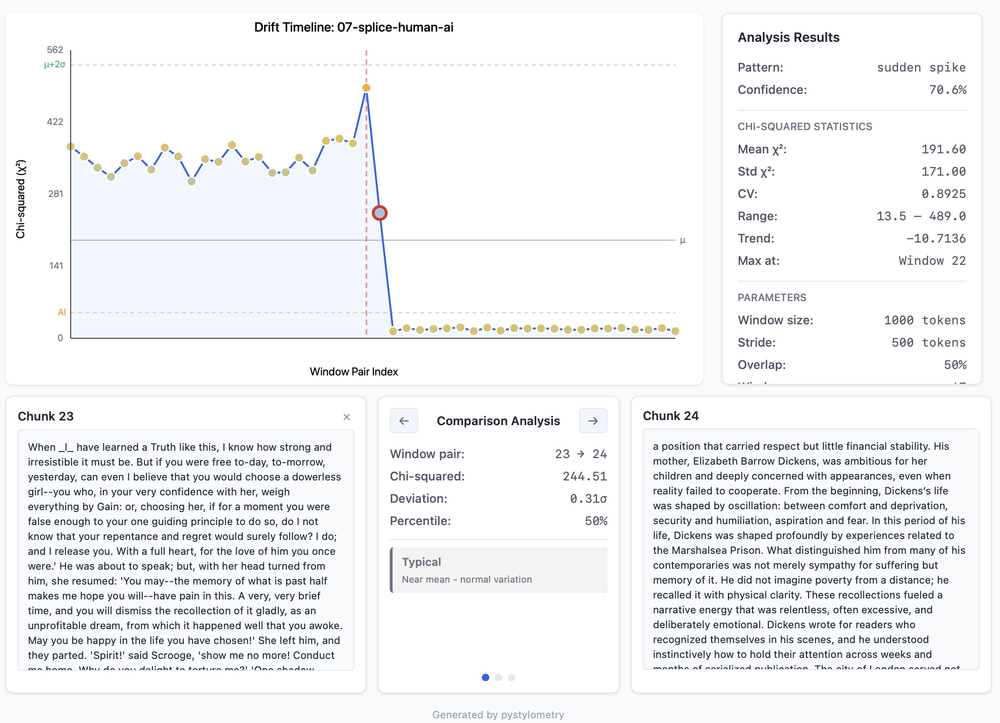

# Kilgarriff Chi-Squared Method

## Detecting Stylistic Boundaries in Text

The visualization below shows pystylometry analyzing a document that splices text from two different sources. The algorithm detects the exact location where the writing style changes.



**Reading the visualization:**

- The x-axis represents sequential window pairs through the document
- The y-axis shows chi-squared values (higher values indicate greater stylistic difference)
- The horizontal gray line marks the mean chi-squared across all comparisons
- The red dashed vertical line marks the detected spike location
- Points are color-coded: yellow/orange indicates elevated values, green indicates typical variation

In this example, windows 22 and 23 produce a chi-squared value of 489.0, compared to a document mean of 191.60. The algorithm classifies this as a "sudden spike" pattern with 70.6% confidence. Examining the chunk text reveals the boundary: Chunk 23 contains Victorian-era prose while Chunk 24 shifts to biographical exposition about Elizabeth Barrow Dickens.

This detection capability has applications in:

- Authorship verification (detecting ghostwritten sections)
- Plagiarism analysis (identifying pasted content)
- AI-generated content detection (finding human/AI boundaries)
- Editorial analysis (locating heavily revised passages)

---

## Theoretical Background

### Origins

Adam Kilgarriff introduced the chi-squared method for corpus comparison in his 2001 paper "Comparing Corpora" (Kilgarriff 97-133). The method was designed to measure statistical distance between two text corpora based on word frequency distributions. Unlike earlier approaches that relied on rare words or stylistic markers, Kilgarriff's method uses the most frequent words in a combined corpus, which provides robust statistical power even for relatively short texts.

### The Chi-Squared Statistic

The chi-squared test measures discrepancy between observed and expected frequencies. For two texts A and B, the method proceeds as follows:

1. Combine both texts into a joint corpus
2. Extract the N most frequent words from the joint corpus
3. For each word w, compute expected frequency assuming both texts share the same underlying distribution
4. Sum the squared deviations, normalized by expected frequency

The expected frequency for word w in text T is:

```
E(w, T) = count(w, joint) × size(T) / size(joint)
```

The chi-squared contribution for each word:

```
χ²(w) = (O(w, A) - E(w, A))² / E(w, A) + (O(w, B) - E(w, B))² / E(w, B)
```

Total chi-squared is the sum across all N words:

```
χ² = Σ χ²(w) for w in top N words
```

### Interpretation

Lower chi-squared values indicate texts with similar word frequency distributions, suggesting common authorship or style. Higher values indicate divergent distributions. The method is particularly sensitive to function words (the, and, of, to) because these words:

- Occur frequently enough for statistical reliability
- Are used unconsciously by authors
- Resist deliberate manipulation
- Vary systematically across authors and genres

### Degrees of Freedom

The degrees of freedom for the test equal N - 1, where N is the number of words analyzed. However, Kilgarriff notes that the standard chi-squared distribution is not directly applicable because the independence assumption is violated in natural language (Kilgarriff 108). Adjacent words are not independent; "of the" is far more likely than "of of". For this reason, the raw chi-squared value is more useful as a relative measure than as a basis for p-value computation.

---

## Implementation

### Core Algorithm

The pystylometry implementation follows Kilgarriff's method with the following parameters:

| Parameter | Default | Description |
|-----------|---------|-------------|
| `n_words` | 500 | Number of most frequent words to analyze |
| `window_size` | 1000 | Tokens per sliding window (drift detection) |
| `stride` | 500 | Token offset between consecutive windows |
| `comparison_mode` | sequential | How windows are compared |

The `n_words` parameter controls the vocabulary size. Kilgarriff used 500 words in his original experiments, which balances statistical power against noise from low-frequency words.

### Sliding Window Drift Detection

For intra-document analysis, pystylometry extends Kilgarriff's two-text comparison to a sliding window approach:

1. Divide the document into overlapping windows of `window_size` tokens
2. Compare consecutive windows using the chi-squared method
3. Track chi-squared values across the document timeline
4. Detect patterns: consistent, gradual drift, sudden spike, or suspiciously uniform

The overlap ratio is calculated as:

```
overlap = (window_size - stride) / window_size
```

With defaults of 1000/500, this produces 50% overlap, ensuring smooth transitions and reducing boundary artifacts.

### Pattern Classification

The implementation classifies chi-squared timelines into four patterns:

**Consistent**: Low variance in chi-squared values, all values near the mean. Indicates uniform writing style throughout the document. Typical of single-author, single-session writing.

**Gradual Drift**: Chi-squared values show a monotonic trend (increasing or decreasing). May indicate author fatigue, topic evolution, or progressive revision. The trend is measured via linear regression slope.

**Sudden Spike**: One or more comparisons produce chi-squared values significantly above the mean (greater than mean + 2σ). Indicates an abrupt stylistic boundary. Common causes include pasted content, different authorship, or major editorial intervention.

**Suspiciously Uniform**: Near-zero variance across all comparisons. Chi-squared values cluster tightly around the mean with coefficient of variation below 0.1. This pattern is uncharacteristic of natural human writing and may indicate AI-generated content or heavily templated text.

### Thresholds

Pattern detection uses the following thresholds:

```python
spike_threshold = mean + 2 * std
ai_uniformity_threshold = 0.1  # coefficient of variation
trend_significance = 0.5      # normalized slope
```

These thresholds were calibrated against test corpora including:

- Single-author Victorian novels (Doyle, Dickens, Austen)
- Deliberately spliced texts combining two authors
- AI-generated text from GPT and Claude models
- Human-AI hybrid documents

### Top Contributing Words

For each pairwise comparison, the implementation records which words contribute most to the chi-squared value. This provides interpretability: rather than a single number, users can see that the spike at window 23 is driven by divergent usage of "the", "was", "his", and "a".

The contribution for each word is:

```python
contribution = (observed - expected)² / expected
```

The top 8 contributors are stored with each comparison result.

### Pure Python Chi-Squared CDF

The implementation includes a pure Python computation of the chi-squared cumulative distribution function, eliminating the scipy dependency. The CDF is computed via the regularized incomplete gamma function:

```
P(χ² ≤ x | df) = P(df/2, x/2)
```

where P(a, z) is the regularized lower incomplete gamma function. The implementation uses series expansion for small x and continued fraction approximation for large x, achieving machine-precision agreement with scipy.stats.chi2.cdf.

---

## Usage

### Two-Text Comparison

```python
from pystylometry.authorship import compute_kilgarriff

result = compute_kilgarriff(text_a, text_b, n_words=500)

print(f"Chi-squared: {result.chi_squared:.2f}")
print(f"Top contributors: {result.most_distinctive_features[:5]}")
```

### Intra-Document Drift Detection

```python
from pystylometry.consistency import compute_kilgarriff_drift

result = compute_kilgarriff_drift(
    text,
    window_size=1000,
    stride=500,
    n_words=500,
)

print(f"Pattern: {result.pattern}")
print(f"Confidence: {result.pattern_confidence:.1%}")
print(f"Spike location: {result.max_location}")
```

### Command Line

```bash
# Text analysis with JSON output
pystylometry-drift manuscript.txt --json

# Interactive HTML visualization
pystylometry-drift manuscript.txt --viz-all ./output
```

---

## Limitations

### Independence Assumption

The chi-squared test assumes independent observations. Words in natural language are not independent; syntactic and semantic constraints create dependencies. The chi-squared value should be interpreted as a distance metric rather than a formal test statistic.

### Window Size Sensitivity

Small windows (under 500 tokens) may produce noisy chi-squared values due to sparse word counts. Large windows (over 2000 tokens) may smooth over genuine stylistic boundaries. The default of 1000 tokens represents a balance, but optimal window size depends on the expected scale of stylistic variation.

### Vocabulary Effects

The method is sensitive to the `n_words` parameter. Using too few words (under 100) discards information; using too many (over 1000) introduces noise from low-frequency words with unreliable statistics.

### Genre and Register

Chi-squared values are not directly comparable across genres. A chi-squared of 200 between two academic papers means something different than 200 between a novel and a technical manual. Comparisons are most meaningful within a single document or between documents of similar type.

---

## References

Kilgarriff, Adam. "Comparing Corpora." *International Journal of Corpus Linguistics*, vol. 6, no. 1, 2001, pp. 97-133. doi:10.1075/ijcl.6.1.05kil

Oakes, Michael P. *Statistics for Corpus Linguistics*. Edinburgh University Press, 1998.

Burrows, John. "'Delta': A Measure of Stylistic Difference and a Guide to Likely Authorship." *Literary and Linguistic Computing*, vol. 17, no. 3, 2002, pp. 267-287.

Stamatatos, Efstathios. "A Survey of Modern Authorship Attribution Methods." *Journal of the American Society for Information Science and Technology*, vol. 60, no. 3, 2009, pp. 538-556.

Eder, Maciej, et al. "Stylometry with R: A Package for Computational Text Analysis." *The R Journal*, vol. 8, no. 1, 2016, pp. 107-121.
